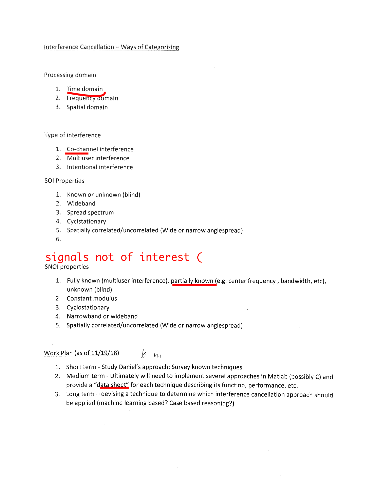
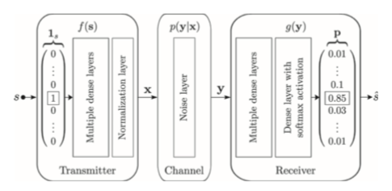
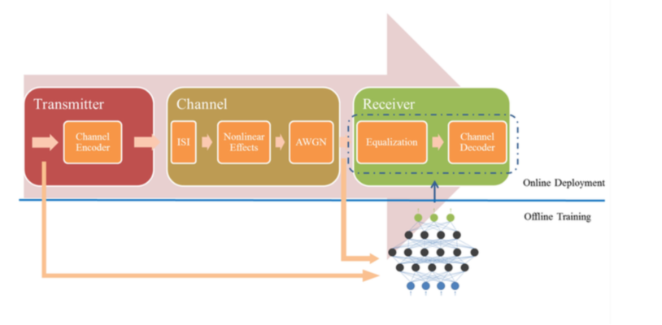
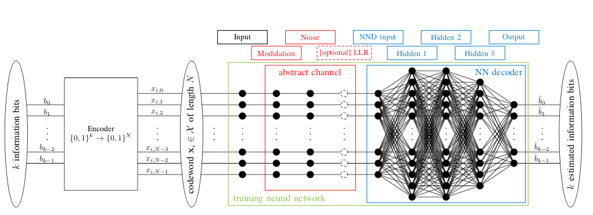

# framework

# Interference Cancellation
[Jakubisin, Daniel J., and R. Michael Buehrer. "Approximate joint MAP detection of co-channel signals in non-Gaussian noise." IEEE Transactions on Communications 64.10 (2016): 4224-4237.](https://ieeexplore.ieee.org/stamp/stamp.jsp?tp=&arnumber=7534739)
* [jakubisin2016approximates]  

[Jakubisin, Daniel J., and R. Michael Buehrer. "Approximate joint MAP detection of co-channel signals." Military Communications Conference, MILCOM 2015-2015 IEEE. IEEE, 2015.](https://ieeexplore.ieee.org/stamp/stamp.jsp?tp=&arnumber=7357662)
* [jakubisin2015approximate]

# BCJR
* [nib no](http://www.ii.uib.no/~eirik/INF244/Lectures/Lecture11.pdf)
* [NCTU TW](http://mapl.nctu.edu.tw/sample/MPEG/cwww/wiki/core/uploads/Course/CC2011/7.pdf)
* [Caltech](http://www.work.caltech.edu/~ling/webs/EE127/EE127C/homework/Ling.pdf)

# CMAP
Concurrent MAP Detector
[Jiang, Wei, and Daoben Li. "Iterative single-antenna interference cancellation: algorithms and results." IEEE Transactions on vehicular technology 58.5 (2009): 2214-2224](https://ieeexplore.ieee.org/stamp/stamp.jsp?tp=&arnumber=4703273)
* c16
* [jiang2009iterative]

# Rake Gaussian
[Ping, Li, Lihai Liu, and W. K. Leung. "A simple approach to near-optimal multiuser detection: interleave-division multiple-access." Wireless Communications and Networking, 2003. WCNC 2003. 2003 IEEE. Vol. 1. IEEE, 2003.](https://ieeexplore.ieee.org/stamp/stamp.jsp?tp=&arnumber=1200381)
* c13
* [ping2003simple]

# Neural Network Alternative
## general 
* [Qin, Zhijin, et al. "Deep learning in physical layer communications." arXiv preprint arXiv:1807.11713 (2018).](https://arxiv.org/pdf/1807.11713.pdf)
    * [qin2018deep]
    * why ML
        * Mathematical model versus practical imperfection
        * Block structures versus global optimality
        * Robust signal processing algorithms versus low costs
    * GAN to accelerate classfication
* [O’Shea, Timothy, and Jakob Hoydis. "An introduction to deep learning for the physical layer." IEEE Transactions on Cognitive Communications and Networking 3.4 (2017): 563-575.](https://ieeexplore.ieee.org/stamp/stamp.jsp?tp=&arnumber=8054694)
    * [o2017introduction]
    * 
    * DeepSig & Virginia Tech
    * BPSK, multi-user
    * without CSI

## detection
* [Ye, Hao, Geoffrey Ye Li, and Biing-Hwang Juang. "Power of deep learning for channel estimation and signal detection in OFDM systems." IEEE Wireless Communications Letters 7.1 (2018): 114-117.](https://ieeexplore.ieee.org/stamp/stamp.jsp?tp=&arnumber=8052521)
    * [ye2018power]
    * end-to-end without CSI
    *  OFDM
    * Baseline: LS, MMSE
* [Farsad, Nariman, and Andrea Goldsmith. "Detection algorithms for communication systems using deep learning." arXiv preprint arXiv:1705.08044 (2017).](https://arxiv.org/pdf/1705.08044.pdf)
    * [farsad2017detection]
    * moleceluar when channel model N/A

## decode
* [Nachmani, Eliya, Yair Be'ery, and David Burshtein. "Learning to decode linear codes using deep learning." Communication, Control, and Computing (Allerton), 2016 54th Annual Allerton Conference on. IEEE, 2016.](https://ieeexplore.ieee.org/stamp/stamp.jsp?arnumber=7852251)
    * [nachmani2016learning]
    * independence of the performance on the txed codeword
    

# Extensive
*   Ye, Hao, and Geoffrey Ye Li. "Initial results on deep learning for joint channel equalization and decoding." Vehicular Technology Conference (VTC-Fall), 2017 IEEE 86th. IEEE, 2017.  
    * [ye2017initial]
    * > the back propagation is very similar to belief propagation, the traditional decoding algorithm
    *  more than white gaussian noise, OFDM
    * Baseline: __Gaussian process for classification (GPC)+successive cancellation(SC)__, __MMSE+SC__
* Xu, Weihong, et al. "Polar decoding on sparse graphs with deep learning." arXiv preprint arXiv:1811.09801 (2018).
    * [xu2018polar]
    * __LDPC decode__
    * Baseline: __sum-product algorithm(SPA)__,__Min-Sum__
* Gruber, Tobias, et al. "On deep learning-based channel decoding." Information Sciences and Systems (CISS), 2017 51st Annual Conference on. IEEE, 2017.
    * [gruber2017deep]
    * 
    * Baseline: __MAP__
    * Conclusion:
        * structured codes are easier to learn
        *  the neural network is able to generalize to codewords that it has never seen during training for structured, but not for random codes.
* Kim, Minhoe, et al. "Deep Learning-Aided SCMA." IEEE Communications Letters 22.4 (2018): 720-723.
    * SCMA encode and decode